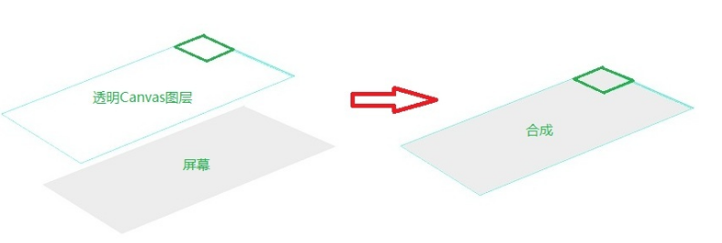
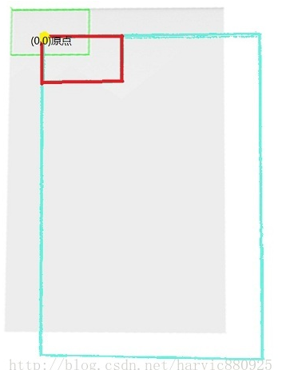
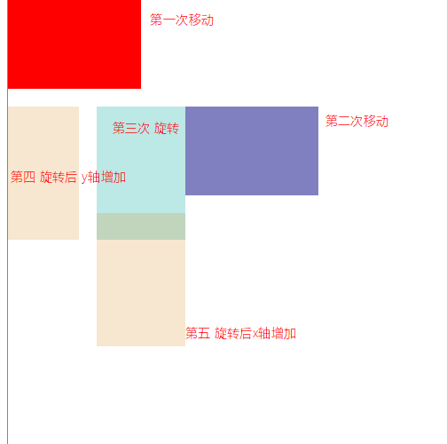

## canvas 笔录

- moveTo 与 lineTo 的区别

  1. `moveTo` 是断点操作，`lineTo` 是连续操作
  2. `beginPath` 清空之前的状态
  3. `beginPath` + `lineTo` = `moveTo`


- beginPath and closePath

  1. 构建封闭的多边形（往往最后一个点不用写，自动处理封闭）

  ​

- difference between fill()  and  stroke()

  1. `fill()` 在 `stroke()`后面使用，会有一个效果，`border`的一半宽度会被填充颜色覆盖


- 刷新canvas 方法

  > ctx.canvas.height = ctx.canvas.height;


- 获取**点击点**距离**目标四周** 的位置 (通用方法)

  > var x = event.clientX - canvas.getBoundingClientRect().left;
  >
  > var y = event.clientY - canvas.getBoundingClinetRect().top;

### 剖析canvas 画布 与 screem 的区别

>很多童鞋一直以为显示所画东西的改屏幕就是Canvas，其实这是一个非常错误的理解
>
>由于屏幕显示与Canvas根本不是一个概念！Canvas是一个很虚幻的概念，相当于一个透明图层（用过PS的同学应该都知道），每次Canvas画图时（即调用Draw系列函数），都会产生一个透明图层，然后在这个图层上画图，画完之后覆盖在屏幕上显示。所以上面的两个结果是由下面几个步骤形成的：
>
>- 调用canvas.drawRect(rect1, paint_green);时，产生一个Canvas透明图层，由于当时还没有对坐标系平移，所以坐标原点是（0，0）；再在系统在Canvas上画好之后，覆盖到屏幕上显示出来，过程如下图：
>
>
>
>- 然后再第二次调用canvas.drawRect(rect1, paint_red);时，又会重新产生一个全新的Canvas画布，但此时画布坐标已经改变了，即向右和向下分别移动了100像素，所以此时的绘图方式为：（合成视图，从上往下看的合成方式）
>
>


> ### 总结
> 1. 每次调用canvas.drawXXXX系列函数来绘图进，都会产生一个全新的Canvas画布。
> 2. 如果在DrawXXX前，调用平移、旋转等函数来对Canvas进行了操作，那么这个操作是不可逆的！每次产生的画布的最新位置都是这些操作后的位置。Save()、Restore()的画布可逆
> 3. 在Canvas与屏幕合成时，超出屏幕范围的图像是不会显示出来的
> 4. 关于rotate, scale，其实就是把`canvas`画布的坐标系旋转 或者 缩放
>
> ```js
> 			ctx.save();
> 			ctx.beginPath();
> 			ctx.fillStyle = 'red';
> 			ctx.rect(0,0,150,100);
> 			ctx.fill();
> 			
> 			/*ctx.translate(100, 100);
> 			ctx.beginPath();
> 			ctx.fillStyle = 'green';
> 			ctx.globalAlpha = 0.7;
> 			ctx.rect(20,20,150,100);
> 			ctx.fill();*/
> 			
> 			ctx.translate(200, 120);
> 			ctx.beginPath();
> 			ctx.fillStyle = '#000080';
> 			ctx.globalAlpha = 0.5;
> 			ctx.rect(0,0,150,100);
> 			ctx.fill();
> 			
> 			ctx.rotate(Math.PI / 2);
> 			ctx.beginPath();
> 			ctx.fillStyle = '#20B2AA';
> 			ctx.globalAlpha = 0.3;
> 			ctx.rect(0,0,150,100);
> 			ctx.fill();
> 			
> 			ctx.save();
> 			ctx.translate(0, 120);
> 			ctx.beginPath();
> 			ctx.fillStyle = '#D58512';
> 			ctx.globalAlpha = 0.2;
> 			ctx.rect(0,0,150,100);
> 			ctx.fill();
> 			ctx.restore();
> 			
> 			ctx.save();
> 			ctx.translate(120, 0);
> 			ctx.beginPath();
> 			ctx.fillStyle = '#D58512';
> 			ctx.globalAlpha = 0.2;
> 			ctx.rect(0,0,150,100);
> 			ctx.fill();
> 			ctx.restore();
> ```
> *图示*
> 

### 注意 `canva` `transform` 与 `div transform` 的区别

canvas 一切transform 基于原点， 只是画布改变， 本身canvas dom 节点没有改变

div 随着transform 而改变自身​， 不是基于原点，比如缩放会


